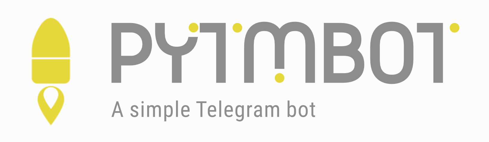

# pyTMbot

A simple Telegram bot designed to gather basic information about the status of your __local__ servers.
The bot operates synchronously. It does not use webhooks.

[](https://sonarcloud.io/summary/new_code?id=orenlab_pytmbot)
[](https://sonarcloud.io/summary/new_code?id=orenlab_pytmbot)
[](https://sonarcloud.io/summary/new_code?id=orenlab_pytmbot)
[](https://sonarcloud.io/summary/new_code?id=orenlab_pytmbot)
[](https://sonarcloud.io/summary/new_code?id=orenlab_pytmbot)
[](https://sonarcloud.io/summary/new_code?id=orenlab_pytmbot)
[](https://sonarcloud.io/summary/new_code?id=orenlab_pytmbot)
[](https://app.codacy.com/gh/orenlab/pytmbot/dashboard?utm_source=gh&utm_medium=referral&utm_content=&utm_campaign=Badge_grade)

The bot was written using the [pyTelegramBotAPI](https://github.com/eternnoir/pyTelegramBotAPI).
Use [psutil](https://github.com/giampaolo/psutil) and [docker-py](https://github.com/docker/docker-py) libraries for
gather information.

## 💡 Features

- Load average information
- Summary memory usage information (with swap)
- Sensors information
- Summary process information
- Uptime information
- File system base information
- Containers (only docker and only on Linux) base information
- Use `Jinja2` for answers template
- Use docker logs collector (`sudo docker logs container_id`)
- Use emoji :)

Screenshots are available here: [screenshots.md](docs/screenshots.md).
Video demo see in Youtube Shorts [here](https://youtube.com/shorts/81RE_PNjxLQ?feature=shared)

## 🪤 Requirements

Initially, the bot was designed to ensure its correct operation only within the Docker container. I have not tested it
running on a local system, either inside or outside a virtual environment.
Therefore, please make sure that Docker is installed on your system.

Full list of Python dependencies see in `requirements.txt`

## 🔌 Installation, setup and run bot

- _See [installation.md](docs/installation.md)_

## 🛡 Secure

The bot has an authorization mechanism. That is based on a unique value we can get from the message's
variable `from_user.id`, which is the Telegram user ID.
By comparing this value with the `user.id` values specified in the bot's settings
(which is done at the initial stage of configuring the bot), we can determine the behavior of the bot.

All failed attempts to authorize are logged with an `ERROR` flag.

## 🌲 Bot tree

```
├── Dockerfile                              - Main Dockerfile
├── LICENSE                                 - Licence file
├── README.md                               - Main README
├── SECURITY.md                             - Security police
├── app
│   ├── __init__.py                         
│   ├── core
│   │   ├── __init__.py                     - Bot core
│   │   ├── adapters
│   │   │   ├── __init__.py
│   │   │   ├── docker_adapter.py           - Docker adapter
│   │   │   ├── podman_adapter.py           - Podman adapter (in dev, not used in prod bot)
│   │   │   └── psutil_adapter.py           - Psutil adapter
│   │   ├── exceptions.py                   - Custom exceptions
│   │   ├── handlers
│   │   │   ├── __init__.py
│   │   │   ├── default_handlers
│   │   │   │   ├── __init__.py             - Import all defaults handlers
│   │   │   │   ├── containers_handler.py   - Container handler
│   │   │   │   ├── fs_handler.py           - Filesystem handler
│   │   │   │   ├── load_avg_handler.py     - Load average handler
│   │   │   │   ├── memory_handler.py       - Memory handler
│   │   │   │   ├── process_handler.py      - Process handler
│   │   │   │   ├── sensors_handler.py      - Sensors handler
│   │   │   │   ├── start_handler.py        - Main, start handler
│   │   │   │   └── uptime_handlers.py      - Uptime handler
│   │   │   ├── handler.py                  - Main handler module
│   │   │   ├── handlers_aggregator.py      - Main handlers aggregator
│   │   │   └── inline_handlers
│   │   │       ├── __init__.py             - Import all inline handlers
│   │   │       ├── inline_query_handler.py - Note use in bot
│   │   │       └── swap_handler.py         - Swap inline handler
│   │   ├── jinja2
│   │   │   ├── __init__.py
│   │   │   └── jinja2.py                   - Main jinja2 module
│   │   ├── keyboards
│   │   │   ├── __init__.py
│   │   │   └── keyboards.py                - Main keyboards  
│   │   ├── middleware
│   │   │   ├── __init__.py
│   │   │   └── auth.py                     - Auth middleware
│   │   └── settings
│   │       ├── __init__.py
│   │       ├── keyboards.py                - Keyboards settings
│   │       └── loggers.py                  - Logger templates
│   ├── main.py                             - Main bot module
│   ├── templates
│   │   ├── containers.jinja2               - Containers jinja2 template 
│   │   ├── fs.jinja2                       - Filesystem jinja2 template
│   │   ├── index.jinja2                    - Start jinja2 template
│   │   ├── load_average.jinja2             - Load average jinja2 template
│   │   ├── memory.jinja2                   - Memory jinja2 template
│   │   ├── none.jinja2                     - Docker jinja2 template
│   │   ├── process.jinja2                  - Process jinja2 template
│   │   ├── sensors.jinja2                  - Sensors jinja2 template
│   │   ├── swap.jinja2                     - Swap jinja2 template
│   │   └── uptime.jinja2                   - Uptime jinja2 template
│   └── utilities
│       ├── __init__.py
│       └── utilities.py                    - Some utility
├── bot_cli
│   ├── cfg_templates
│   │   ├── bot_settings.py                 - Template for initial setup
│   │   └── env.py                          - Template for initial setup
│   └── fs.py                               - Filesystem utility
├── dev.Dockerfile                          - Dockerfile with mod=dev 
├── docker-compose.yml                      - Docker Compose file (used main Dockerfile)
├── docs
│   ├── installation.md                     - Installation guide
│   ├── roadmap.md                          - Roadmap guide
│   └── screenshots.md                      - Bots screenshot
├── logs
│   └── pytmbot.log                         - Main logs file
├── poetry.lock                             - Poetry file
├── pyproject.toml                          - Poetry file
├── requirements.txt                        - Requirements for build Docker image
├── setup_bot.py                            - Initial setup bot script
├── setup_req.txt                           - Setup requirements
├── tests
│   └── bot_tests.py                        - Bots tests
└── ubuntu.Dockerfile                       - Dockerfile, based on Ubuntu image
```

## 📈 Roadmap

- See [roadmap.md](docs/roadmap.md)

## 👾 Known issues

- You tell me :)

## 🧬 Authors

- [@orenlab](https://github.com/orenlab)

## 🚀 About Me

I am a novice Python developer. This is my first publicly available project in this great programming language.

## 📜 License

[](https://choosealicense.com/licenses/mit/)
