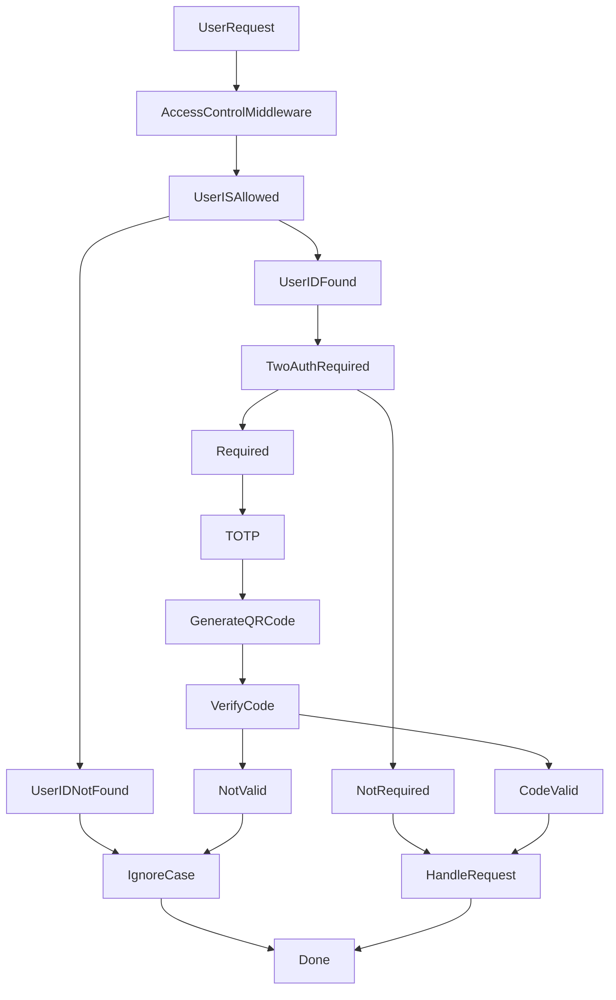

# 📜 Access Control for pyTMBot 🚪🔐

## 🔍 Overview

The access control mechanism in **pyTMBot** ensures that only authorized users can access certain functionalities. This
process involves several key steps, including user identification, authentication, and authorization.

## 🔧 Session management

In the latest updates, several improvements were implemented to enhance security and
reliability:

1. **Automatic Session Cleanup**:
    - The `clear_expired_sessions` method is now called during each initialization of the `SessionManager` instance.
      This ensures that expired sessions are regularly cleared, enhancing security by removing stale data.

2. **Improved Safety Checks**:
    - Methods that manipulate user data now include comprehensive checks to ensure data integrity and prevent errors.

## 📊 Workflow Diagram

## 📱 Access Control Process

### 1. User Request 📲

When a user initiates a request, it first passes through the access control middleware.

### 2. Access Control Middleware 🛡️

The middleware evaluates whether the user is allowed to perform the requested action based on their ID and other
criteria.

### 3. User Identification ✅

The system checks if the user ID is recognized and valid.

- **User ID Found**: The system has identified the user.
- **User ID Not Found**: The system does not recognize the user.

### 4. Two-Factor Authentication (2FA) 🔐

If the user is recognized, the system then determines if two-factor authentication is required:

- **Two-Factor Authentication Required**: The user must provide additional verification.
    - **Generate QR Code**: A QR code is generated for the user to scan with their authentication app.
    - **Verify Code**: The user submits a one-time password (OTP) generated by their authentication app.
        - **Code Valid**: If the OTP is correct, the user is authenticated, and the request is handled.
        - **Code Not Valid**: If the OTP is incorrect, access is denied, and the case is ignored.
- **Two-Factor Authentication Not Required**: The user can proceed without additional verification.

### 5. Handle Request 🛠️

Once authentication is complete (if required), or if no additional authentication is needed, the request is processed.

### 6. Done ✅

The access control process is complete, and the user’s request is either handled or denied based on the outcome of the
above checks.

## 📬 Conclusion

This access control mechanism ensures secure and efficient management of user requests, balancing accessibility with
necessary security measures.

For further information or to report issues, please refer to
our [GitHub repository](https://github.com/orenlab/pytmbot/issues) or [contact support](mailto:pytelemonbot@mail.ru).
