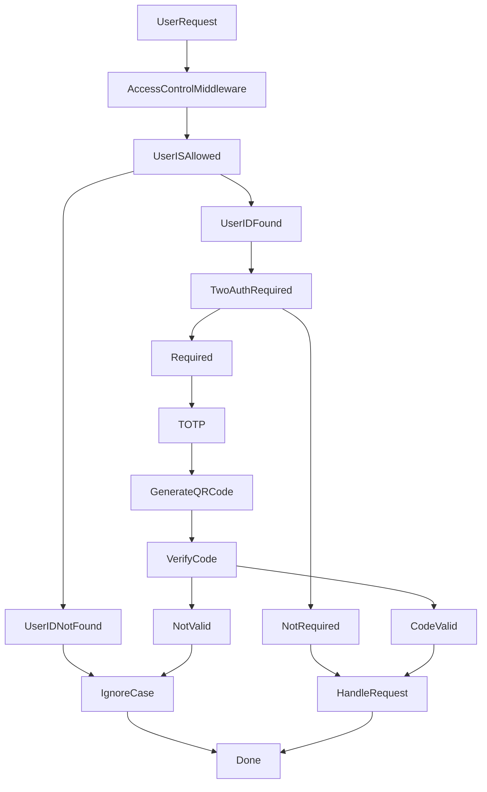

```mermaid
graph TD
UserRequest --> AccessControlMiddleware --> UserISAllowed --> UserIDFound --> TwoAuthRequired
UserISAllowed --> UserIDNotFound --> IgnoreCase --> Done
TwoAuthRequired --> Required --> TOTP
TwoAuthRequired --> NotRequired --> HandleRequest
TOTP --> GenerateQRCode --> VerifyCode --> CodeValid --> HandleRequest
VerifyCode --> NotValid --> IgnoreCase
HandleRequest --> Done
```