# 📜 Access Control for pyTMBot 🚪🔐

## 🔍 Overview

The access control mechanism in **pyTMBot** ensures that only authorized users can access certain functionalities. This
process involves several key components working together: **AccessControl middleware**, **SessionManager**, user
identification, authentication, authorization, and comprehensive security monitoring with real-time admin alerts.

## 🏗️ Architecture Components

### 1. **AccessControl Middleware** 🛡️

- Handles unauthorized access attempts
- Implements automatic blocking system
- Provides real-time admin notifications
- Manages attempt tracking and cleanup

### 2. **SessionManager** 🔐

- Thread-safe session management with singleton pattern
- Handles user authentication states
- Manages TOTP (Two-Factor Authentication) attempts
- Implements session expiration and cleanup
- Provides comprehensive session statistics

## 🔧 Session Management

The SessionManager implements several advanced features:

### **Thread-Safe Architecture**

- Singleton pattern with weak references for memory efficiency
- Named instances support for different contexts
- RLock-based synchronization for thread safety

### **Session States** (`_StateFabric`)

- `AUTHENTICATED`: User is fully authenticated
- `PROCESSING`: Authentication in progress
- `BLOCKED`: User is temporarily blocked
- `UNAUTHENTICATED`: User needs authentication

### **Automatic Cleanup System**

- Background cleanup thread runs every 600 seconds (configurable)
- Automatic session expiration (10 minutes default)
- Memory-efficient expired session removal
- Graceful shutdown handling

### **Security Features**

- **TOTP Management**: Maximum 5 attempts before auto-blocking
- **Temporary Blocking**: 10-minute blocks for security violations
- **Session Timeout**: 10-minute inactivity timeout
- **Referer Tracking**: Handler type and URI tracking for security context

## 🚨 Security Monitoring & Admin Alerts

### **AccessControl Middleware Protection**

1. **Real-time Admin Notifications**:
    - Immediate alerts sent to admin via `global_chat_id`
    - Detailed information with masked user data for privacy
    - Smart suppression (300 seconds per user) to prevent spam

2. **Automatic Blocking System**:
    - Users blocked after 3 failed attempts (`MAX_ATTEMPTS`)
    - 1-hour block duration (`BLOCK_DURATION`)
    - Automatic cleanup every hour (`CLEANUP_INTERVAL`)

3. **Security Intelligence**:
    - Token leak detection hints
    - Proactive security recommendations
    - Comprehensive audit trail with timestamps

4. **Data Privacy Protection**:
    - Username masking via `mask_username()` function
    - User ID masking via `mask_user_id()` function
    - Automatic sensitive data protection in communications

## 📊 Updated Comprehensive Workflow Diagram

```mermaid
graph TD
    UserRequest[👤 User Request] --> AccessMiddleware[🛡️ Access Control Middleware]
    
    AccessMiddleware --> CheckBlocked{🚫 User Blocked?}
    CheckBlocked -->|Yes| BlockResponse[⛔ Block Response]
    CheckBlocked -->|No| CheckAllowed{✅ User Allowed?}
    
    CheckAllowed -->|No| HandleUnauth[🚨 Handle Unauthorized]
    CheckAllowed -->|Yes| SessionCheck[🔐 Session Check]
    
    HandleUnauth --> IncrementAttempts[📊 Increment Attempts]
    IncrementAttempts --> CheckMaxAttempts{Max Attempts?}
    CheckMaxAttempts -->|Yes| BlockUser[🚫 Block User]
    CheckMaxAttempts -->|No| NotifyAdmin[📢 Notify Admin]
    BlockUser --> NotifyAdmin
    NotifyAdmin --> DenyAccess[❌ Deny Access]
    
    SessionCheck --> SessionManager[🔐 Session Manager]
    SessionManager --> CheckAuthState{Auth State?}
    
    CheckAuthState -->|BLOCKED| BlockResponse
    CheckAuthState -->|UNAUTHENTICATED| StartAuth[🔑 Start Authentication]
    CheckAuthState -->|PROCESSING| ContinueAuth[⏳ Continue Authentication]
    CheckAuthState -->|AUTHENTICATED| ValidateSession{Session Valid?}
    
    ValidateSession -->|Expired| ExpireSession[⏰ Expire Session]
    ValidateSession -->|Valid| HandleRequest[✅ Handle Request]
    ExpireSession --> StartAuth
    
    StartAuth --> CheckTOTP{TOTP Required?}
    CheckTOTP -->|Yes| Generate2FA[🔐 Generate 2FA]
    CheckTOTP -->|No| SetAuthenticated[✅ Set Authenticated]
    
    Generate2FA --> ShowQR[📱 Show QR Code]
    ShowQR --> SetProcessing[⏳ Set Processing State]
    SetProcessing --> WaitTOTP[⏱️ Wait for TOTP]
    
    ContinueAuth --> VerifyTOTP{Verify TOTP?}
    VerifyTOTP -->|Valid| ResetAttempts[🔄 Reset TOTP Attempts]
    VerifyTOTP -->|Invalid| IncrementTOTP[📈 Increment TOTP Attempts]
    
    ResetAttempts --> SetAuthenticated
    IncrementTOTP --> CheckTOTPMax{Max TOTP Attempts?}
    CheckTOTPMax -->|Yes| BlockUserTOTP[🚫 Block User - TOTP]
    CheckTOTPMax -->|No| RetryTOTP[🔄 Retry TOTP]
    
    BlockUserTOTP --> SecurityAlert[🚨 Security Alert]
    SecurityAlert --> DenyAccess
    RetryTOTP --> WaitTOTP
    
    SetAuthenticated --> SetLoginTime[⏰ Set Login Time]
    SetLoginTime --> HandleRequest
    
    HandleRequest --> LogAccess[📝 Log Access]
    LogAccess --> ProcessRequest[⚙️ Process Request]
    ProcessRequest --> Done[✅ Done]
    
    DenyAccess --> Done
    BlockResponse --> Done
    
    %% Background Processes
    CleanupThread[🧹 Cleanup Thread] --> CleanupExpired[🗑️ Clean Expired Sessions]
    CleanupThread --> CleanupBlocked[🗑️ Clean Expired Blocks]
    CleanupExpired --> CleanupBlocked
    
    %% Admin Monitoring
    AdminDashboard[📊 Admin Dashboard] --> SessionStats[📈 Session Statistics]
    AdminDashboard --> SecurityAlerts[🚨 Security Alerts]
    AdminDashboard --> AuditTrail[📋 Audit Trail]
    
    style UserRequest fill:#e1f5fe
    style AccessMiddleware fill:#f3e5f5
    style SessionManager fill:#e8f5e8
    style HandleRequest fill:#e8f5e8
    style SecurityAlert fill:#ffebee
    style BlockUser fill:#ffebee
    style CleanupThread fill:#fff3e0
    style AdminDashboard fill:#f1f8e9
```



## 📱 Enhanced Access Control Process

### 1. **User Request Processing** 📲

When a user initiates a request, it passes through multiple security layers:

#### **Access Control Middleware Layer**

- **Request Validation**: Initial request filtering and validation
- **User Identification**: Extract user ID and metadata
- **Block Status Check**: Verify if user is currently blocked
- **Authorization Check**: Validate against allowed user IDs

#### **Session Management Layer**

- **Session Retrieval**: Get or create user session
- **State Validation**: Check current authentication state
- **Context Management**: Thread-safe session access

### 2. **Security Alert System** 🚨

#### **Unauthorized Access Handling**

```python
# Key Constants
MAX_ATTEMPTS = 3  # Maximum failed attempts
BLOCK_DURATION = 3600  # 1 hour block duration
ADMIN_NOTIFY_SUPPRESSION = 300  # 5 minutes notification suppression
```

**Process Flow:**

1. **Attempt Tracking**: Increment unauthorized access counter
2. **Threshold Check**: Evaluate against `MAX_ATTEMPTS`
3. **Auto-Blocking**: Apply temporary block if threshold exceeded
4. **Admin Notification**: Send masked security alert to admin
5. **Audit Logging**: Record detailed security event

#### **Privacy-Compliant Notifications**

- **User Identity Protection**: All user data masked in admin alerts
- **Structured Messaging**: Consistent alert format with actionable information
- **Spam Prevention**: Intelligent suppression to prevent notification flooding

### 3. **Session State Management** 🔐

#### **Authentication States**

```python
class _StateFabric:
    AUTHENTICATED = "authenticated"  # Full access granted
    PROCESSING = "processing"  # Authentication in progress
    BLOCKED = "blocked"  # Temporarily blocked
    UNAUTHENTICATED = "unauthenticated"  # Needs authentication
```

#### **Session Lifecycle**

1. **Creation**: New session with `UNAUTHENTICATED` state
2. **Authentication**: State progression through auth process
3. **Validation**: Continuous session validity checks
4. **Expiration**: Automatic cleanup after timeout
5. **Cleanup**: Background thread removes expired sessions

### 4. **Two-Factor Authentication (2FA)** 🔐

#### **TOTP Management**

- **Attempt Limiting**: Maximum 5 TOTP attempts before blocking
- **Auto-Blocking**: Automatic user blocking on max attempts
- **State Tracking**: Session state management during auth process
- **QR Code Generation**: Secure TOTP setup process

#### **Security Features**

- **Time-based Validation**: Standard TOTP protocol implementation
- **Attempt Reset**: Successful auth resets attempt counter
- **Block Integration**: TOTP failures contribute to blocking system

### 5. **Background Maintenance** 🧹

#### **Cleanup Operations**

- **Session Cleanup**: Removes expired sessions (600s interval)
- **Block Cleanup**: Removes expired blocks (3600s interval)
- **Memory Management**: Efficient resource utilization
- **Thread Safety**: All cleanup operations are thread-safe

#### **Statistics and Monitoring**

```python
# Available Session Statistics
{
    "total_sessions": int,
    "authenticated_sessions": int,
    "blocked_sessions": int,
    "expired_sessions": int,
    "processing_sessions": int
}
```

## 🔒 Security Configuration

### **AccessControl Middleware Settings**

```python
MAX_ATTEMPTS = 3  # Failed attempts before blocking
BLOCK_DURATION = 3600  # Block duration in seconds
CLEANUP_INTERVAL = 3600  # Cleanup interval in seconds
ADMIN_NOTIFY_SUPPRESSION = 300  # Admin notification suppression
```

### **SessionManager Settings**

```python
cleanup_interval = 600  # Background cleanup interval
session_timeout = 10  # Session timeout in minutes
max_totp_attempts = 5  # Maximum TOTP attempts
block_duration = 10  # Block duration in minutes
```

## 🛡️ Advanced Security Features

### **Thread-Safe Architecture**

- **Singleton Pattern**: Named instances with weak references
- **Lock Management**: RLock for complex operations
- **Context Managers**: Safe session access patterns
- **Memory Efficiency**: Automatic cleanup and weak references

### **Comprehensive Logging**

- **Structured Logging**: Consistent log format with context
- **Security Events**: Detailed audit trail
- **Performance Monitoring**: Session statistics and metrics
- **Privacy Compliance**: Automatic data masking

### **Admin Security Dashboard**

- **Real-time Alerts**: Immediate security notifications
- **Session Statistics**: Comprehensive session monitoring
- **Audit Trail**: Complete security event history
- **Proactive Recommendations**: Security best practices guidance

## 🚀 Best Practices

1. **Regular Monitoring**: Review admin alerts and session statistics
2. **Token Management**: Follow recommendations for token rotation
3. **Configuration Tuning**: Adjust timeouts and attempt limits based on usage
4. **Audit Reviews**: Regular security event analysis
5. **Update Management**: Keep security settings current

## 📊 Monitoring and Diagnostics

### **Session Statistics**

- Active session count monitoring
- Authentication state distribution
- Block and expiration tracking
- Performance metrics collection

### **Security Metrics**

- Unauthorized access attempt frequency
- Blocking effectiveness analysis
- Admin notification patterns
- System performance impact

## 📬 Conclusion

This comprehensive access control system provides enterprise-grade security through multi-layered protection,
intelligent monitoring, and automated threat response. The combination of AccessControl middleware and SessionManager
ensures robust security while maintaining usability and performance.

The system balances security with user experience through intelligent blocking, session management, and
privacy-compliant monitoring, making it suitable for production environments requiring strict access control.

For further information or to report issues, please refer to
our [GitHub repository](https://github.com/orenlab/pytmbot/issues) or [contact support](mailto:pytelemonbot@mail.ru).