# 📜 Access Control for pyTMBot 🚪🔐

## 🔍 Overview

The access control mechanism in **pyTMBot** ensures that only authorized users can access certain functionalities. This
process involves several key steps, including user identification, authentication, authorization, and comprehensive
security monitoring with real-time admin alerts.

## 🔧 Session Management

In the latest updates, several improvements were implemented to enhance security and reliability:

1. **Automatic Session Cleanup**:
    - The `clear_expired_sessions` method is now called during each initialization of the `SessionManager` instance.
      This ensures that expired sessions are regularly cleared, enhancing security by removing stale data.

2. **Improved Safety Checks**:
    - Methods that manipulate user data now include comprehensive checks to ensure data integrity and prevent errors.

3. **Enhanced Rights Verification**:
    - Improved mechanism for verifying user rights with better access control
    - Enhanced logging system for permission-related events
    - Fixed image update checking functionality

## 🚨 Security Monitoring & Admin Alerts

### Advanced Unauthorized Access Protection

The system now includes comprehensive protection against unauthorized access attempts:

1. **Real-time Admin Notifications**:
    - Immediate alerts sent to admin via `global_chat_id` for unauthorized access attempts
    - Detailed information about the security incident with masked user data

2. **Automatic Blocking System**:
    - Users are automatically blocked after exceeding `MAX_ATTEMPTS`
    - Timestamped messages for audit trail
    - Smart suppression interval (300 seconds per user) to prevent spam

3. **Security Intelligence**:
    - Admin messages include hints about possible token leaks
    - Recommendations for token regeneration when suspicious activity detected
    - Proactive security guidance for administrators

4. **Data Privacy Protection**:
    - **Username masking**: Utilizes `mask_username()` function to protect user identities
    - **User ID masking**: Employs `mask_user_id()` function for privacy compliance
    - Sensitive data automatically masked in all admin communications

## 📊 Updated Workflow Diagram

```mermaid
graph TD
    UserRequest --> AccessControlMiddleware
    AccessControlMiddleware --> UserISAllowed
    UserISAllowed --> UserIDFound
    UserISAllowed --> UserIDNotFound
    UserIDNotFound --> SecurityAlert[🚨 Security Alert]
    SecurityAlert --> AdminNotification[📢 Admin Notification]
    AdminNotification --> CheckAttempts{Max Attempts?}
    CheckAttempts -->|Yes| BlockUser[🚫 Block User]
    CheckAttempts -->|No| IgnoreCase
    BlockUser --> IgnoreCase
    UserIDFound --> TwoAuthRequired
    TwoAuthRequired --> Required
    TwoAuthRequired --> NotRequired
    NotRequired --> HandleRequest
    Required --> TOTP
    TOTP --> GenerateQRCode
    GenerateQRCode --> VerifyCode
    VerifyCode --> CodeValid
    VerifyCode --> NotValid
    CodeValid --> HandleRequest
    NotValid --> SecurityAlert
    HandleRequest --> Done
    IgnoreCase --> Done
```

## 📱 Enhanced Access Control Process

### 1. User Request 📲

When a user initiates a request, it first passes through the enhanced access control middleware with comprehensive
security monitoring.

### 2. Access Control Middleware 🛡️

The middleware evaluates whether the user is allowed to perform the requested action based on their ID and other
criteria, with improved rights verification mechanism.

### 3. User Identification ✅

The system checks if the user ID is recognized and valid with enhanced logging:

- **User ID Found**: The system has identified the user and proceeds with authentication.
- **User ID Not Found**: The system triggers security alert protocol.

### 4. Security Alert Protocol 🚨

When unauthorized access is detected:

1. **Immediate Admin Notification**:
    - Real-time alert sent to admin via `global_chat_id`
    - Masked user information using `mask_username()` and `mask_user_id()`
    - Timestamp and attempt details included

2. **Attempt Tracking**:
    - System tracks number of unauthorized attempts per user
    - Implements suppression interval (300s) to prevent spam

3. **Automatic Blocking**:
    - Users exceeding `MAX_ATTEMPTS` are automatically blocked
    - Timestamped blocking message for audit trail

4. **Security Intelligence**:
    - Admin receives hints about possible token leaks
    - Recommendations for token regeneration provided

### 5. Two-Factor Authentication (2FA) 🔐

If the user is recognized, the system determines if two-factor authentication is required:

- **Two-Factor Authentication Required**: The user must provide additional verification.
    - **Generate QR Code**: A QR code is generated for the user to scan with their authentication app.
    - **Verify Code**: The user submits a one-time password (OTP) generated by their authentication app.
        - **Code Valid**: If the OTP is correct, the user is authenticated, and the request is handled.
        - **Code Not Valid**: If the OTP is incorrect, security alert protocol is triggered.
- **Two-Factor Authentication Not Required**: The user can proceed without additional verification.

### 6. Handle Request 🛠️

Once authentication is complete (if required), or if no additional authentication is needed, the request is processed
with enhanced security context.

### 7. Done ✅

The access control process is complete, and the user's request is either handled or denied based on the comprehensive
security evaluation.

## 🔒 Security Features Summary

### Data Protection

- **Username Masking**: `mask_username()` function protects user identities
- **User ID Masking**: `mask_user_id()` function ensures privacy compliance
- **Sensitive Data Protection**: Automatic masking in all communications

### Access Control

- **Enhanced Rights Verification**: Improved mechanism with better logging
- **Real-time Monitoring**: Immediate detection of unauthorized access
- **Automatic Blocking**: Smart blocking system with attempt tracking

### Admin Security Dashboard

- **Real-time Alerts**: Immediate notifications for security incidents
- **Audit Trail**: Comprehensive logging with timestamps
- **Security Intelligence**: Proactive recommendations and hints
- **Spam Prevention**: Intelligent suppression intervals

## 🛡️ Best Practices

1. **Regular Token Rotation**: Follow admin recommendations for token regeneration
2. **Monitor Admin Alerts**: Pay attention to security notifications
3. **Review Access Logs**: Regularly check permission-related events
4. **Update Security Settings**: Keep `MAX_ATTEMPTS` and suppression intervals configured appropriately

## 📬 Conclusion

This enhanced access control mechanism provides comprehensive security management with real-time monitoring, automated
threat response, and intelligent admin notifications. The system balances accessibility with robust security measures,
ensuring both user privacy and system integrity.

For further information or to report issues, please refer to
our [GitHub repository](https://github.com/orenlab/pytmbot/issues) or [contact support](mailto:pytelemonbot@mail.ru).