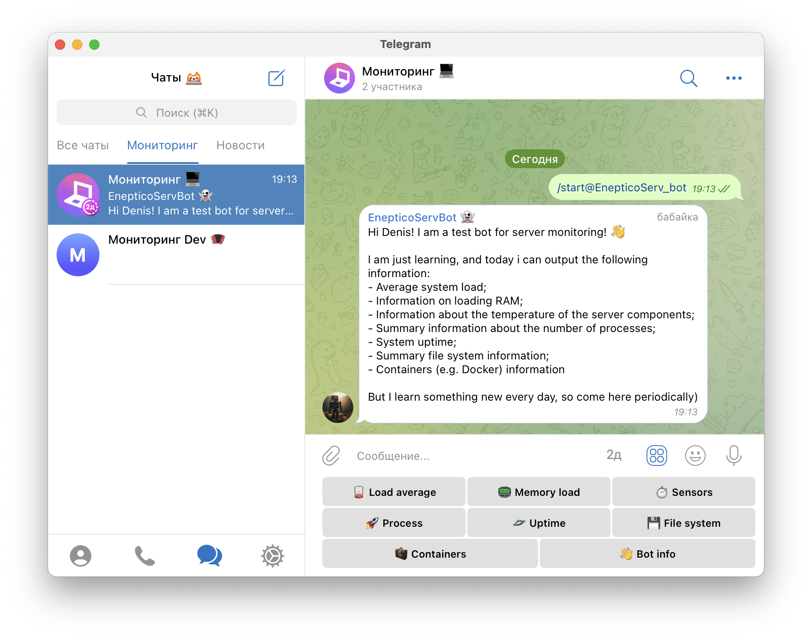
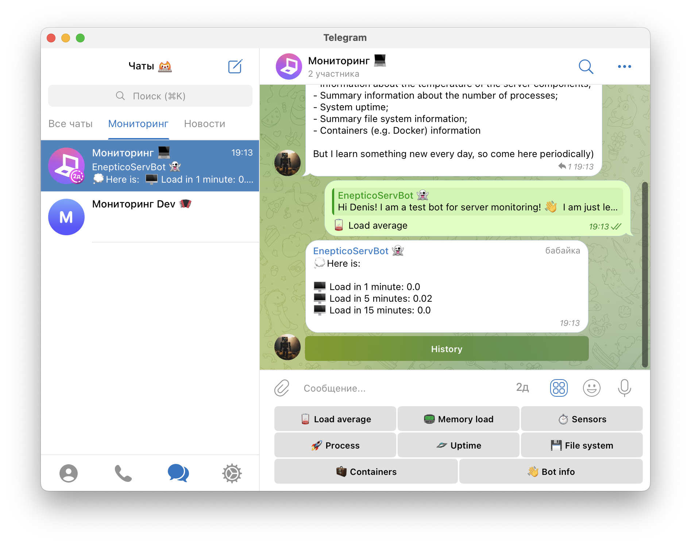
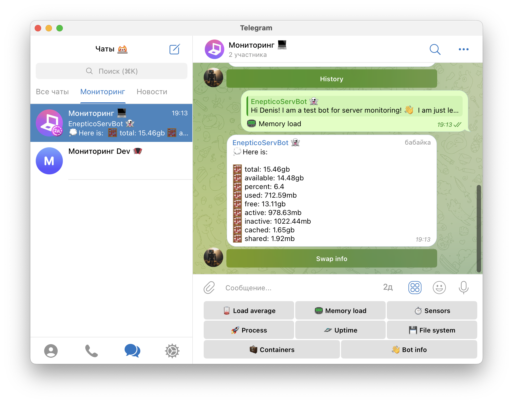
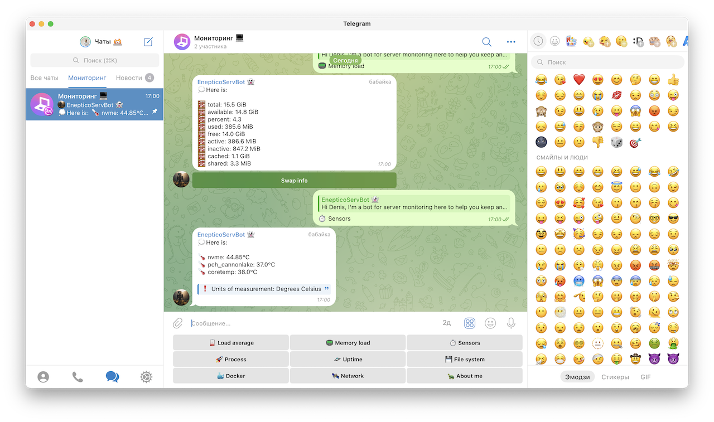
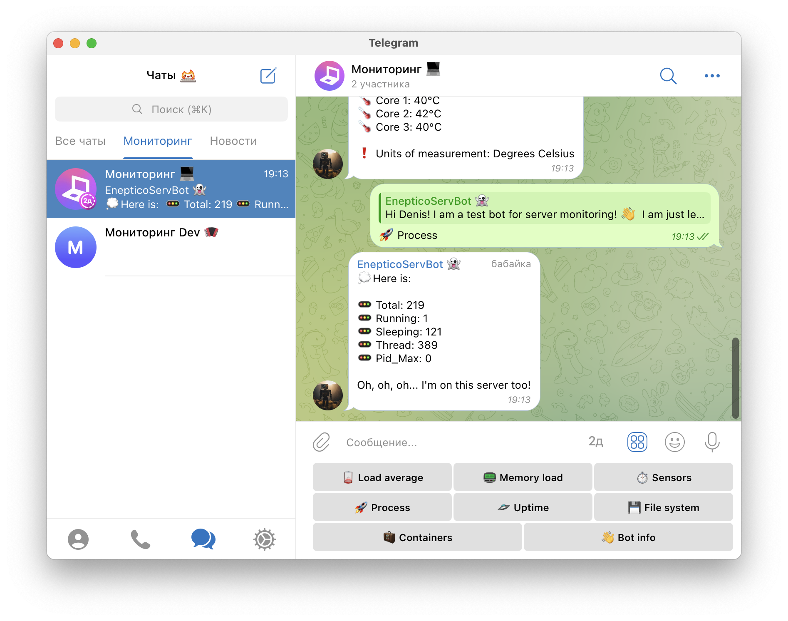
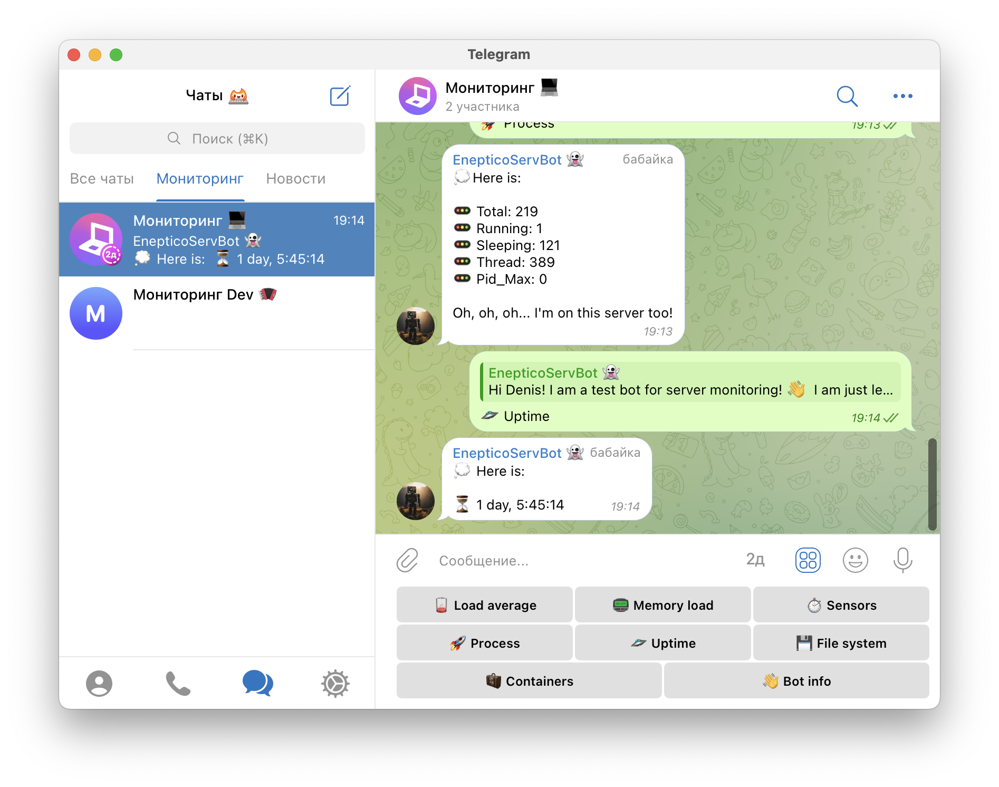
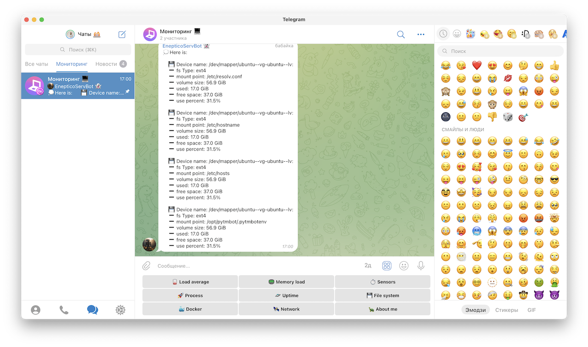
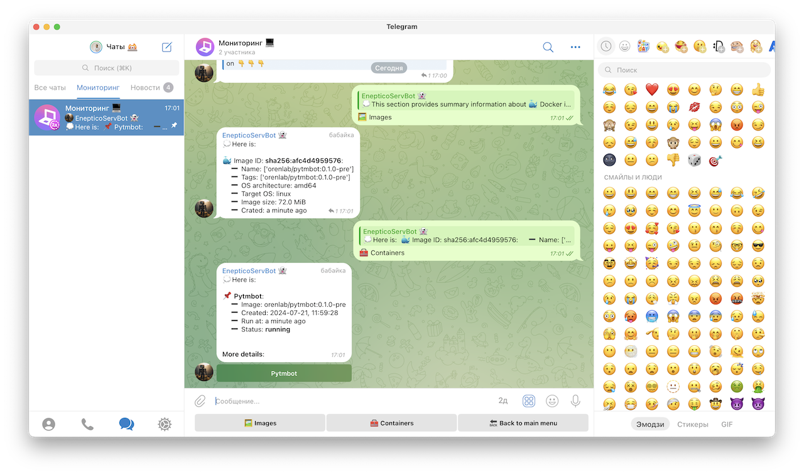

# pyTMBot screenshots

__Important: Some of the features visible in the images are 
still in development and may not yet be available for use.__

## Start handler:

## Load average handler:

## Memory handler:

## Sensors handler:

## Process handler:

## Uptime handler:

## File system handler:

## Containers handler:
