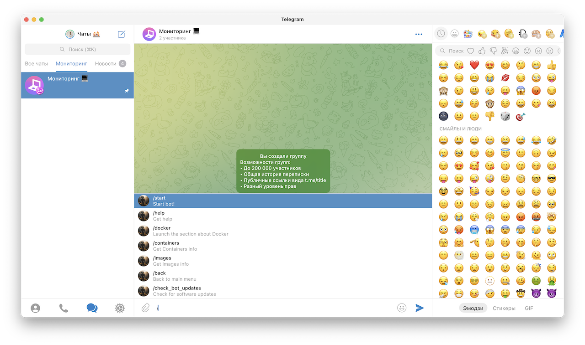
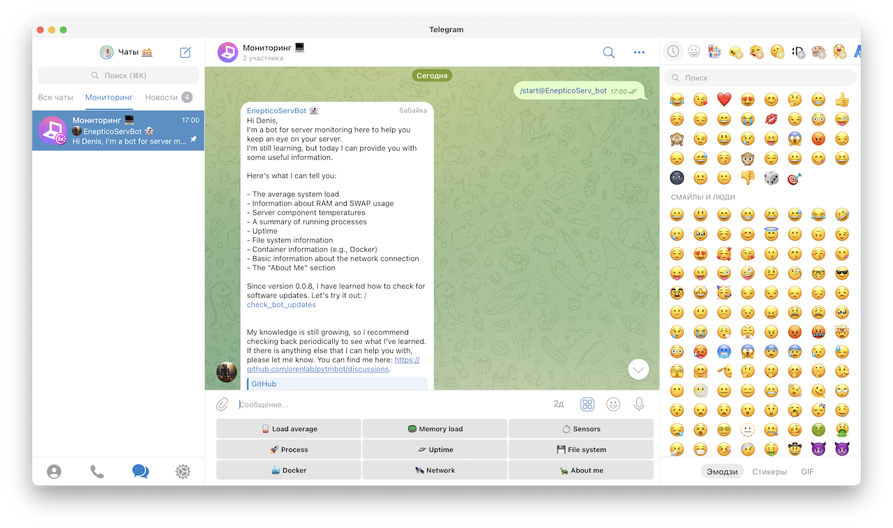
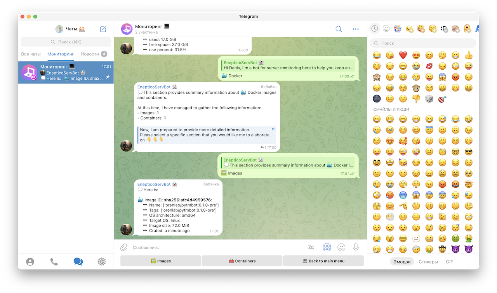
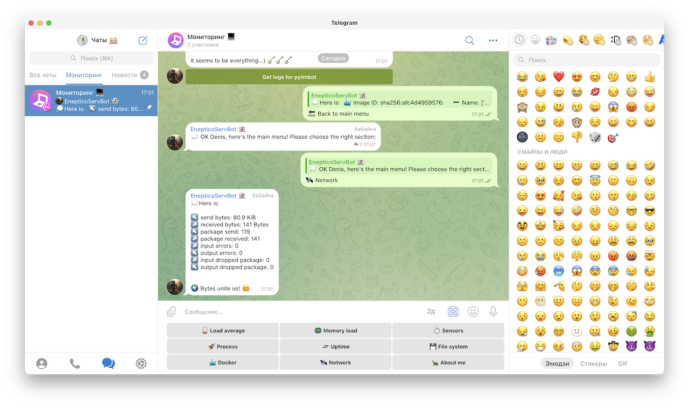
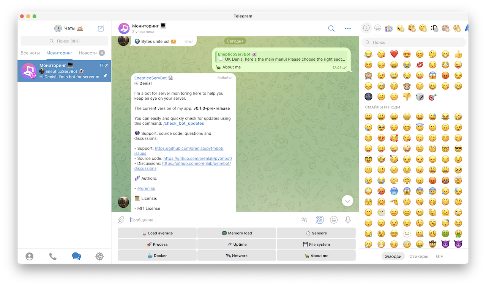

# pyTMBot screenshots

__Important: Some of the features visible in the images are
still in development and may not yet be available for use.__

## Commands:

## Start handler:

## Load average handler:

## Memory handler:

## Sensors handler:

## Process handler:

## Uptime handler:

## File system handler:

## Docker handler:

## Images handler:

## Container handler:

## Network handler:

## About handler:

